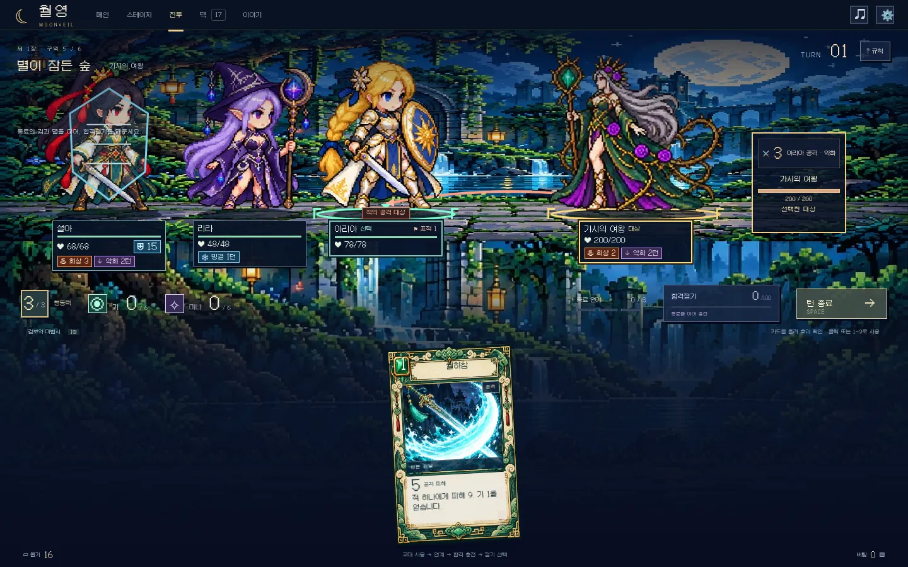
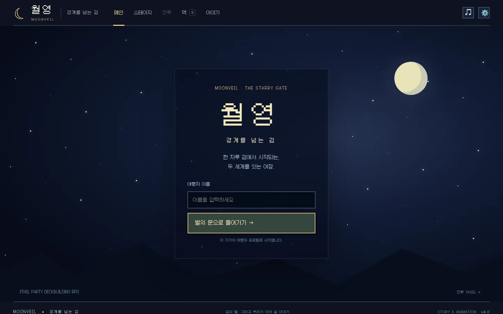
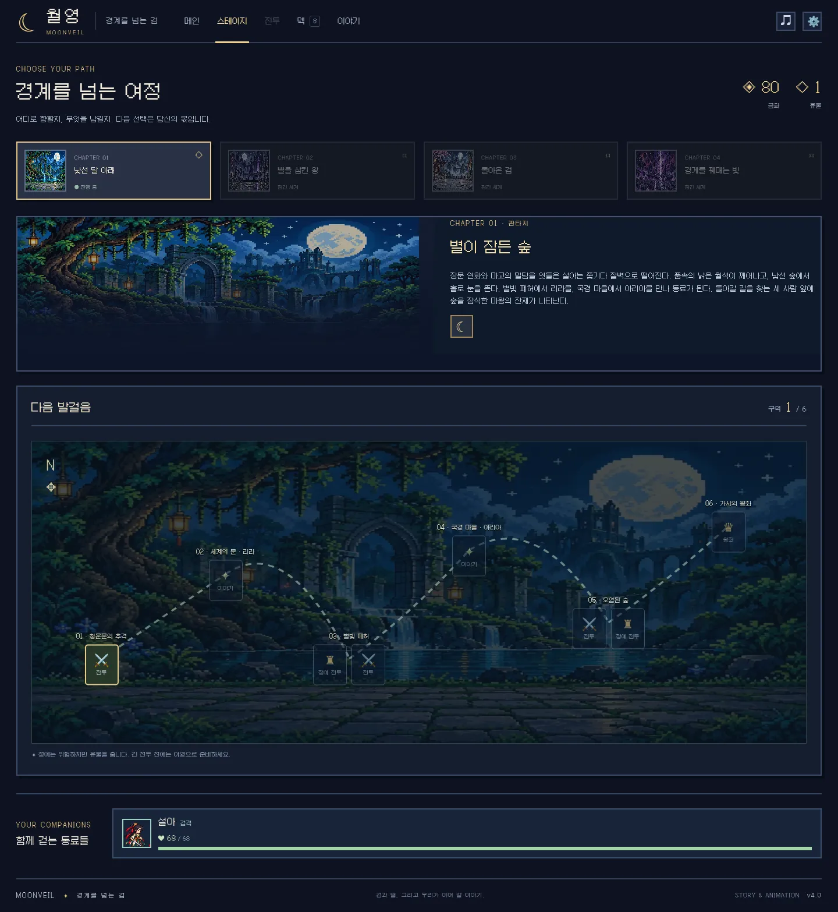
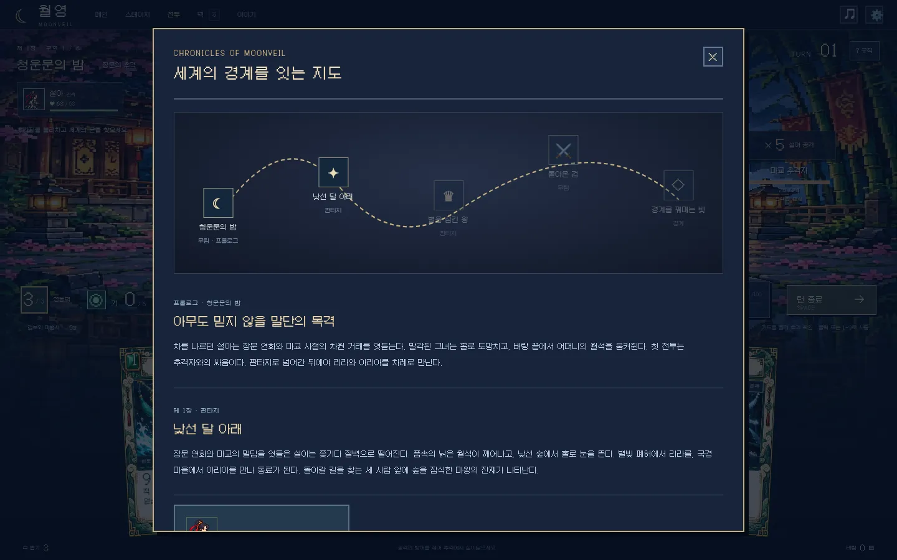
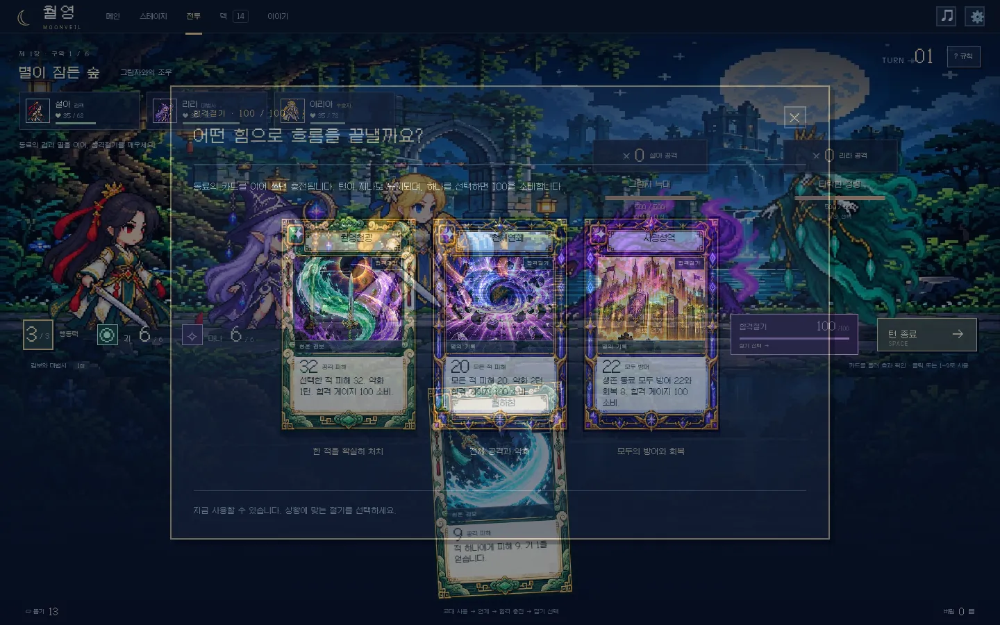

# 월영: 경계를 넘는 검

**무림과 마법의 경계를 넘는 여성 동료들의 픽셀 아트 파티 덱빌딩 게임.**

전투 연출과 카드 구성을 개편한 v5입니다. 4장 캠페인을 통해 전투, 분기 경로, 카드 선택, 덱 강화와 정리, 우두머리 전투, 엔딩까지 진행할 수 있습니다. 이미지와 한글 도트 폰트를 저장소에 포함한 정적 웹 게임으로, 외부 API나 런타임 패키지 설치 없이 실행됩니다.

[게임 바로 플레이](https://taan9448.github.io/third/) · [소스 저장소](https://github.com/Taan9448/third)



## v5 전장 가독성과 타격 보강

- 동일 격자 자르기 대신 실제 그림을 분리해 54개 포즈를 재생합니다. 옆 프레임의 머리·무기 조각이 섞이지 않으며 발 기준점을 맞추고 가로·세로에 같은 배율을 사용합니다. 모바일에서는 파티가 겹치지 않도록 크기를 조정합니다.
- 캐릭터 몸이나 발밑 이름표를 누르면 해당 동료가 강조됩니다. 적은 금색 테두리·발밑 표시로 선택을 확인합니다.
- 체력, 보호막 흡수량, 상태이상 종류·수치·남은 턴을 각 대상 발밑의 어두운 패널에 표시합니다. 보호막은 육각 방패 모양으로 표현합니다.
- 적의 공격 예고에 대상 이름을 표시하고, 바닥의 연결 화살표와 동료의 '적의 공격 대상' 표식으로 확인합니다. 전체 공격과 빙결로 행동할 수 없는 적도 구분합니다.
- 아군과 적 모두 비행 이후 **접촉 → 확산 → 폭발 → 잔해**의 독립된 4프레임 타격 시트를 재생합니다. 검격·마법·화염·빙결 타격을 구분합니다. 적 공격도 첫 타격 시점에 턴 결과를 한 번 적용합니다.
- 유성우는 화상 2를, 빙결의 룬은 약화 2턴과 빙결 1턴을 적용합니다. 화상은 턴 종료에 표시 수치만큼 보호막을 관통하는 피해를 주고 수치가 1 감소합니다. 약화는 공격 피해를 65%로 줄입니다. 빙결은 적의 다음 행동 또는 동료의 이번 턴 카드 사용을 막습니다.

## v4 화면·이야기·프레임 애니메이션 개편

- 별이 반짝이고 유성이 지나가는 메인에서 여행자 이름으로 입장합니다. 프로필은 이 기기에 저장되며 서버 계정 인증이 아닙니다. 메인에는 캐릭터 이미지를 배치하지 않았습니다.
- 스테이지는 연결된 지도와 갈림길, 이야기 메뉴는 무림 → 판타지 → 귀환 → 세계의 틈의 세계 지도로 구성했습니다. 여정 배경은 가로형으로 표시합니다.
- 설아 혼자 8장의 무공 덱으로 시작하고, 판타지로 넘어가는 이야기 노드에서 리라, 국경 마을에서 아리아가 합류합니다. 합류 시 각 4장을 획득합니다.
- 여성 캐릭터 3명은 SD 도트로 바꾸고, 캐릭터와 몬스터 6종에 각각 6프레임 공격을 연결했습니다. 몬스터 비율은 유지합니다. 16종 기술은 각 4프레임 스킬 시트를 재생합니다.
- 전장을 데스크톱 전체 화면으로 확대하고, 파티·적 의도·자원·손패를 그 안에 배치했습니다. 메인·스테이지·전투는 독립 화면입니다.
- 무공 카드는 청옥·검보 프레임, 판타지 카드는 금속·룬 프레임을 사용합니다. 16종 일러스트는 캐릭터 초상 대신 검에서 나오는 월하참, 유성, 빙정, 방패처럼 기술 자체를 보여 줍니다.
- 카드가 떠오르고 균열이 갈라진 뒤 24개 삼각 파편으로 터집니다. 검기·다중 마력창·유성·빙결·장벽은 각기 다른 동작과 도트 이펙트를 사용합니다. 적중 순간 피해·행동력이 한 번 적용됩니다.
- 카드에 마우스를 올리거나 키보드로 초점을 맞추면 방어·공명·연계를 반영한 실제 예상 피해와 처치 가능 여부가 표시됩니다.
- 동료 교대 사용으로 합격 게이지를 모아, 단일 처형 **월영천광**, 전체 공격·약화 **천체연쇄**, 파티 방어·회복 **서광성역** 중 하나를 선택합니다. 게이지는 턴을 넘어 유지되며 전투마다 초기화됩니다.
- 기존 저장 파일을 이어서 사용할 수 있습니다. 캐릭터는 6프레임 공격과 대기·돌진·피격 동작을 사용하며, 기술 연출을 별도 모듈로 분리했습니다.

[상용 게임 비교와 남은 과제](docs/COMMERCIAL-REVIEW.md)에는 Slay the Spire, Monster Train, Wildfrost의 공식 자료와 비교 기준을 기록했습니다. 이번 버전에서도 카드·유물·적 패턴의 다양성은 상용작보다 작습니다.









## 바로 실행하기

Node.js 20 이상을 설치한 뒤, 이 프로젝트 폴더에서 실행합니다. `npm install`은 필요하지 않습니다.

```bash
npm start
```

브라우저에서 **http://localhost:5173**을 엽니다. 종료할 때는 터미널에서 `Ctrl+C`를 누르세요.

다른 포트가 필요하다면 macOS/Linux에서는 `PORT=8080 npm start`, PowerShell에서는 `$env:PORT=8080; npm start`를 사용합니다.

Python 3이 있다면 `python3 -m http.server 5173`으로도 실행할 수 있습니다. Windows에서는 `py -m http.server 5173`을 사용할 수 있습니다. ES 모듈을 사용하므로 `index.html`을 더블클릭하는 대신 HTTP 서버로 실행하세요.

## GitHub에서 실행하기

GitHub 저장소에는 소스를 보관하고, **GitHub Pages**로 브라우저 게임을 실행합니다. 소스 저장소는 [Taan9448/third](https://github.com/Taan9448/third)입니다. Pages 배포 워크플로가 포함되어 있습니다. 공개 주소는 [https://taan9448.github.io/third/](https://taan9448.github.io/third/)입니다. 아래는 다른 저장소에 복사해 배포하는 방법입니다.

1. GitHub에서 비어 있는 저장소를 만듭니다. Pages를 사용할 수 있는 공개 저장소 또는 해당 기능을 지원하는 계정의 저장소를 사용합니다.
2. **이 README가 있는 폴더의 내용 전체**를 저장소 루트에 올립니다. `.github/workflows/pages.yml`도 포함하세요.
3. 저장소의 **Settings → Pages → Build and deployment → Source**를 **GitHub Actions**로 설정합니다.
4. `main` 브랜치에 푸시하거나 **Actions → Test and deploy Moonveil → Run workflow**를 실행합니다.
5. Actions가 성공하면 Pages에 표시되는 게임 URL을 엽니다. 일반적인 형식은 `https://사용자명.github.io/저장소명/`입니다.

처음 올릴 때 Git을 사용한다면 프로젝트 폴더에서 다음을 실행합니다. 마지막 명령의 저장소 주소를 본인 주소로 바꾸세요.

```bash
git init
git add .
git commit -m "Add Moonveil playable game"
git branch -M main
git remote add origin https://github.com/YOUR_NAME/YOUR_REPO.git
git push -u origin main
```

상대 경로만 사용하므로 저장소 하위 주소에서도 실행됩니다. 기본 브랜치가 `main`이 아니라면 워크플로의 `branches` 항목을 바꾸세요.

## 게임 구성

- **4장·총 24구간**: 낯선 달 아래 / 별을 삼킨 왕 / 돌아온 검 / 경계를 꿰매는 빛.
- **여성 동료 3명**: 검객 설아 혼자 시작합니다. 판타지에서 마법사 리라, 수호자 아리아를 순서대로 만나며 실제 파티와 덱에 합류합니다.
- **카드 16종**: 시작 덱 8장, 두 동료 합류 후 16장, 행동력 공용, 개별 체력·방어, 단일/전체/다단 공격, 약화, 회복, 카드 뽑기, 자원 공명.
- **동료 연계**: 서로 다른 동료의 카드를 연달아 사용하면 3번째 카드의 피해 또는 방어가 증가합니다. 합격 게이지 100에서 세 가지 필살기 중 하나를 사용합니다.
- **기·마나**: 전투 안에서 턴을 넘어 유지됩니다. 두 자원을 함께 모으면 공명 카드가 강해집니다.
- **분기 지도**: 전투, 정예, 이벤트, 상인, 야영, 우두머리. 선택한 노드의 보상을 받은 뒤 다음 구간으로 이동합니다.
- **유물 5종**: 시작 자원, 연계 피해, 턴별 기, 승리 회복 등의 변화.
- **스토리 보스**: 가시의 여왕, 마왕 아스테르, 마교주 혈련, 장문 연화, 지옥왕 나락. 마교주는 3장 5구간에서 반드시 만납니다.
- **전투 연출**: 저장소에 포함한 도트 배경·캐릭터, 대기·돌진·피격 동작, 24조각 카드 균열·파쇄, 기술별 검기·마법·빙결·장벽, 피해 미리보기와 숫자, 공명·합격절기 연출, 합성 효과음.
- **저장**: 매 행동 자동 저장, JSON 내보내기/불러오기, 새 원정. 모바일 대응과 키보드 조작을 지원합니다.

이 버전은 소수의 캐릭터·카드와 텍스트 서사로 전체 게임 흐름을 검증하는 프로토타입입니다. 별도의 음성, 장편 컷신, 캐릭터별 방대한 애니메이션 시트, 수십 명의 동료, 계정/서버 저장은 포함되어 있지 않습니다. 이후 수정하기 쉬운 구조를 우선했습니다.

## 조작과 전투 팁

| 조작 | 기능 |
| --- | --- |
| 적 클릭 | 공격 대상 선택 |
| 카드 클릭 또는 `1`–`9` | 카드 사용 |
| `Space` | 턴 종료 |
| `M` | 지도 |
| `D` | 덱 |
| `Esc` | 열린 창 닫기 |

카드 사용은 게이지 15를 채우고, 직전과 다른 동료라면 25를 채웁니다. 세 동료 연계가 발동하면 15를 추가합니다. 게이지 버튼에서 세 합격절기 중 하나를 선택하면 행동력 소비 없이 게이지 100을 모두 소모합니다.

적 위의 숫자는 다음 공격 피해입니다. 공격할 동료 이름도 표시됩니다. 방어는 동료 모두에게 적용되고 다음 플레이어 턴에 사라집니다. 약화는 공격 피해를 65%로 줄입니다. 3번째 턴마다 우두머리의 전체 공격 또는 강한 검격을 주의하세요.

두 동료가 합류하면 `월하참 → 별빛 화살 → 불굴의 맹세`로 자원을 쌓고 연계 방어를 만드는 조합을 권합니다. `이어진 마음`은 행동력을 쓰지 않고 마나와 손패를 늘립니다. `월영 · 공명`은 기 2와 마나 2가 준비되었을 때 사용하면 추가 피해를 줍니다.

카드를 무조건 많이 받으면 필요한 카드가 늦게 나옵니다. 보상을 건너뛰거나 상인에게 카드를 제거할 수 있습니다. 체력 0인 동료는 카드를 사용할 수 없지만 야영·회복 이벤트·장 전환에서 부활합니다. 모두 쓰러지면 새 원정을 시작해야 합니다.

효과음은 우측 음표 버튼으로 끌 수 있습니다. 브라우저의 소리 정책에 따라 첫 클릭 이후 재생됩니다. 운영체제의 동작 줄이기 설정을 존중합니다.

## 저장과 백업

현재 브라우저의 `localStorage`에 `moonveil-save-v1` 키로 저장합니다. 페이지 주소·브라우저가 달라지면 별도의 저장 공간을 사용합니다. 시크릿 모드나 사이트 데이터 삭제로 저장이 사라질 수 있으므로, 설정에서 JSON을 내보내면 다른 기기나 배포 주소에서 불러올 수 있습니다. 저장 형식이 잘못되었거나 지원하지 않는 버전이면 불러오지 않습니다.

## 검증

```bash
npm test
npm run balance
npm run build
```

- 전투 자원, 연계, 방어, 약화, 사망, 덱 순환, 보상, 상인, 강화, 저장, 보스 및 엔딩 전환 등의 자동 검사를 실행합니다.
- `balance`는 실제 규칙과 기본 덱으로 방어/회복을 고려하는 휴리스틱 플레이어를 30개 시드에서 실행합니다. 전체 캠페인 도달 가능성을 확인하는 검사이며 사람 플레이의 체감 난이도를 대신하지 않습니다.
- `build`는 배포할 `index.html`, `favicon.svg`, `src/`, `assets/`를 `dist/`에 복사합니다.
- 브라우저 검사는 선택 사항입니다. Python Playwright와 Chromium이 있다면 서버 실행 후 `python3 tests/browser_check.py`와 `python3 tests/browser_phases.py`, `python3 tests/browser_combat.py`, `python3 tests/browser_readability.py`를 실행하세요. 다른 서버 주소는 `GAME_URL` 환경 변수로 지정할 수 있습니다. `CHROMIUM_PATH` 환경 변수로 브라우저 실행 파일을 지정할 수 있습니다.

## 수정할 위치

| 파일 | 수정 대상 |
| --- | --- |
| `src/data.js` | 동료, 카드 수치·설명, 유물, 적, 장별 스토리, 이벤트 |
| `src/engine.js` | 턴 처리, 자원·연계, 적 행동, 보상, 분기, 저장 검증 |
| `src/visuals.js` | 도트 에셋 아틀라스, 초상화, 전장 캐릭터 렌더링 |
| `src/cast.js` | 카드 균열·24조각 파쇄, 타격 시점과 입력 잠금 |
| `src/sprites.js` | 포즈 분리·발 기준점·원본 비율과 화면 경계 |
| `src/readability.css` | 발밑 보호막·상태·선택·공격 대상 패널 |
| `src/animation.js` | 6프레임 공격·4프레임 기술의 인덱스와 배치 |
| `src/journey.css` | 별빛 진입·경로 지도·세계 지도 |
| `src/effects.js` | 기술별 검기·마법·방어 이펙트와 아틀라스 |
| `assets/` | 동료·적·카드·배경 WebP 아틀라스와 한글 폰트 |
| `src/art.js` | 에셋 로드 실패 시 대체 그래픽, 합성 효과음 |
| `src/app.js` | 화면, 메뉴, 조작, 보상/이벤트 UI |
| `src/style.css` | 메인·스테이지·메뉴 스타일 |
| `src/battle.css` | v4 전장, 무공/판타지 카드, 모바일 전투 스타일 |
| `docs/DESIGN.md` | 상세 기획과 확장 규칙 |

먼저 `data.js`의 카드 수치나 스토리부터 바꾸면 됩니다. 카드의 실제 효과는 숫자 필드, 화면 설명은 `text` 필드이므로 둘을 함께 바꾸세요. 큰 규칙 변경 시 `npm test`로 회귀를 확인하고 `version`과 저장 형식 변경도 검토하세요.

## 에셋과 라이선스

도트 아틀라스는 이번 게임을 위해 이미지 생성 도구로 제작한 시안이며, WebP로 저장해 함께 배포합니다. 3×6 SD 캐릭터 공격, 6×6 몬스터 공격, 8×4 기술 두 장의 프레임 시트를 포함했습니다. 렌더링에서 이미지 보간을 끄고 픽셀 단위를 유지합니다.

한글 도트 폰트 [Galmuri](https://github.com/quiple/galmuri) 2.40.3은 SIL Open Font License 1.1을 따릅니다. 원문은 `assets/Galmuri-OFL.txt`에 포함했습니다. 런타임에는 외부 폰트 서버에 접속하지 않습니다.
