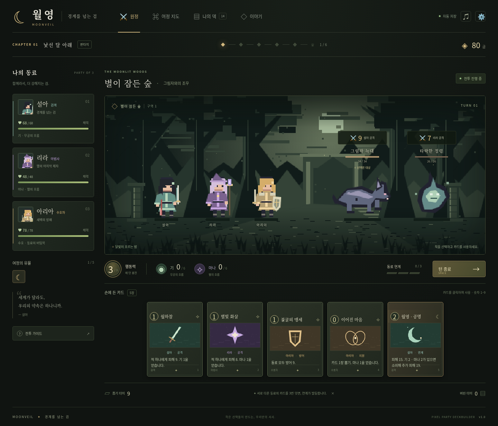

# 월영: 경계를 넘는 검

**무림과 마법의 경계를 넘는 여성 동료들의 픽셀 아트 파티 덱빌딩 게임.**

실제로 플레이할 수 있는 첫 버전입니다. 4장 캠페인을 통해 전투, 분기 경로, 카드 선택, 덱 강화와 정리, 우두머리 전투, 엔딩까지 진행할 수 있습니다. 외부 이미지·폰트·API·런타임 패키지에 의존하지 않는 정적 웹 게임입니다.



## 바로 실행하기

Node.js 20 이상을 설치한 뒤, 이 프로젝트 폴더에서 실행합니다. `npm install`은 필요하지 않습니다.

```bash
npm start
```

브라우저에서 **http://localhost:5173**을 엽니다. 종료할 때는 터미널에서 `Ctrl+C`를 누르세요.

다른 포트가 필요하다면 macOS/Linux에서는 `PORT=8080 npm start`, PowerShell에서는 `$env:PORT=8080; npm start`를 사용합니다.

Python 3이 있다면 `python3 -m http.server 5173`으로도 실행할 수 있습니다. Windows에서는 `py -m http.server 5173`을 사용할 수 있습니다. ES 모듈을 사용하므로 `index.html`을 더블클릭하는 대신 HTTP 서버로 실행하세요.

## GitHub에서 실행하기

GitHub 저장소에는 소스를 보관하고, **GitHub Pages**로 브라우저 게임을 실행합니다. 소스 저장소는 [Taan9448/third](https://github.com/Taan9448/third)입니다. Pages 배포 워크플로가 포함되어 있습니다. 실제 게임 공개는 아래 Pages 설정을 활성화한 뒤 이루어집니다.

1. GitHub에서 비어 있는 저장소를 만듭니다. Pages를 사용할 수 있는 공개 저장소 또는 해당 기능을 지원하는 계정의 저장소를 사용합니다.
2. **이 README가 있는 폴더의 내용 전체**를 저장소 루트에 올립니다. `.github/workflows/pages.yml`도 포함하세요.
3. 저장소의 **Settings → Pages → Build and deployment → Source**를 **GitHub Actions**로 설정합니다.
4. `main` 브랜치에 푸시하거나 **Actions → Test and deploy Moonveil → Run workflow**를 실행합니다.
5. Actions가 성공하면 Pages에 표시되는 게임 URL을 엽니다. 일반적인 형식은 `https://사용자명.github.io/저장소명/`입니다.

처음 올릴 때 Git을 사용한다면 프로젝트 폴더에서 다음을 실행합니다. 마지막 명령의 저장소 주소를 본인 주소로 바꾸세요.

```bash
git init
git add .
git commit -m "Add Moonveil playable game"
git branch -M main
git remote add origin https://github.com/YOUR_NAME/YOUR_REPO.git
git push -u origin main
```

상대 경로만 사용하므로 저장소 하위 주소에서도 실행됩니다. 기본 브랜치가 `main`이 아니라면 워크플로의 `branches` 항목을 바꾸세요.

## 첫 버전의 구성

- **4장·총 24구간**: 낯선 달 아래 / 별을 삼킨 왕 / 돌아온 검 / 경계를 꿰매는 빛.
- **여성 동료 3명**: 검객 설아, 마법사 리라, 수호자 아리아. 초반에 만난 파티로 첫 전투를 시작합니다. 프롤로그와 만남은 이야기 메뉴에 기록되어 있습니다.
- **카드 16종**: 기본 덱 14장, 행동력 공용, 개별 체력·방어, 단일/전체/다단 공격, 약화, 회복, 카드 뽑기, 자원 공명.
- **동료 연계**: 서로 다른 동료의 카드를 연달아 사용하면 3번째 카드의 피해 또는 방어가 증가합니다.
- **기·마나**: 전투 안에서 턴을 넘어 유지됩니다. 두 자원을 함께 모으면 공명 카드가 강해집니다.
- **분기 지도**: 전투, 정예, 이벤트, 상인, 야영, 우두머리. 선택한 노드의 보상을 받은 뒤 다음 구간으로 이동합니다.
- **유물 5종**: 시작 자원, 연계 피해, 턴별 기, 승리 회복 등의 변화.
- **스토리 보스**: 가시의 여왕, 마왕 아스테르, 마교주 혈련, 장문 연화, 지옥왕 나락. 마교주는 3장 5구간에서 반드시 만납니다.
- **전투 연출**: 직접 그린 픽셀 배경·캐릭터, 대기 동작과 공격 돌진, 검격·마법·파편·피해 숫자·공명 연출, 합성 효과음.
- **저장**: 매 행동 자동 저장, JSON 내보내기/불러오기, 새 원정. 모바일 대응과 키보드 조작을 지원합니다.

이 버전은 소수의 캐릭터·카드와 텍스트 서사로 전체 게임 흐름을 검증하는 프로토타입입니다. 별도의 음성, 장편 컷신, 캐릭터별 방대한 애니메이션 시트, 수십 명의 동료, 계정/서버 저장은 포함되어 있지 않습니다. 이후 수정하기 쉬운 구조를 우선했습니다.

## 조작과 전투 팁

| 조작 | 기능 |
| --- | --- |
| 적 클릭 | 공격 대상 선택 |
| 카드 클릭 또는 `1`–`9` | 카드 사용 |
| `Space` | 턴 종료 |
| `M` | 지도 |
| `D` | 덱 |
| `Esc` | 열린 창 닫기 |

적 위의 숫자는 다음 공격 피해입니다. 공격할 동료 이름도 표시됩니다. 방어는 동료 모두에게 적용되고 다음 플레이어 턴에 사라집니다. 약화는 공격 피해를 65%로 줄입니다. 3번째 턴마다 우두머리의 전체 공격 또는 강한 검격을 주의하세요.

처음에는 `월하참 → 별빛 화살 → 불굴의 맹세`로 자원을 쌓고 연계 방어를 만드는 조합을 권합니다. `이어진 마음`은 행동력을 쓰지 않고 마나와 손패를 늘립니다. `월영 · 공명`은 기 2와 마나 2가 준비되었을 때 사용하면 추가 피해를 줍니다.

카드를 무조건 많이 받으면 필요한 카드가 늦게 나옵니다. 보상을 건너뛰거나 상인에게 카드를 제거할 수 있습니다. 체력 0인 동료는 카드를 사용할 수 없지만 야영·회복 이벤트·장 전환에서 부활합니다. 모두 쓰러지면 새 원정을 시작해야 합니다.

효과음은 우측 음표 버튼으로 끌 수 있습니다. 브라우저의 소리 정책에 따라 첫 클릭 이후 재생됩니다. 운영체제의 동작 줄이기 설정을 존중합니다.

## 저장과 백업

현재 브라우저의 `localStorage`에 `moonveil-save-v1` 키로 저장합니다. 페이지 주소·브라우저가 달라지면 별도의 저장 공간을 사용합니다. 시크릿 모드나 사이트 데이터 삭제로 저장이 사라질 수 있으므로, 설정에서 JSON을 내보내면 다른 기기나 배포 주소에서 불러올 수 있습니다. 저장 형식이 잘못되었거나 지원하지 않는 버전이면 불러오지 않습니다.

## 검증

```bash
npm test
npm run balance
npm run build
```

- 전투 자원, 연계, 방어, 약화, 사망, 덱 순환, 보상, 상인, 강화, 저장, 보스 및 엔딩 전환 등의 자동 검사를 실행합니다.
- `balance`는 실제 규칙과 기본 덱으로 방어/회복을 고려하는 휴리스틱 플레이어를 30개 시드에서 실행합니다. 전체 캠페인 도달 가능성을 확인하는 검사이며 사람 플레이의 체감 난이도를 대신하지 않습니다.
- `build`는 배포할 `index.html`, `favicon.svg`, `src/`를 `dist/`에 복사합니다.
- 브라우저 검사는 선택 사항입니다. Python Playwright와 Chromium이 있다면 서버 실행 후 `python3 tests/browser_check.py`를 실행하세요. `CHROMIUM_PATH` 환경 변수로 브라우저 실행 파일을 지정할 수 있습니다.

## 수정할 위치

| 파일 | 수정 대상 |
| --- | --- |
| `src/data.js` | 동료, 카드 수치·설명, 유물, 적, 장별 스토리, 이벤트 |
| `src/engine.js` | 턴 처리, 자원·연계, 적 행동, 보상, 분기, 저장 검증 |
| `src/art.js` | 픽셀 배경, 캐릭터, 이펙트, 효과음 |
| `src/app.js` | 화면, 메뉴, 조작, 보상/이벤트 UI |
| `src/style.css` | 색상, 레이아웃, 카드 디자인, 모바일 스타일 |
| `docs/DESIGN.md` | 상세 기획과 확장 규칙 |

먼저 `data.js`의 카드 수치나 스토리부터 바꾸면 됩니다. 카드의 실제 효과는 숫자 필드, 화면 설명은 `text` 필드이므로 둘을 함께 바꾸세요. 큰 규칙 변경 시 `npm test`로 회귀를 확인하고 `version`과 저장 형식 변경도 검토하세요.
